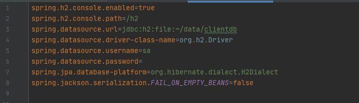
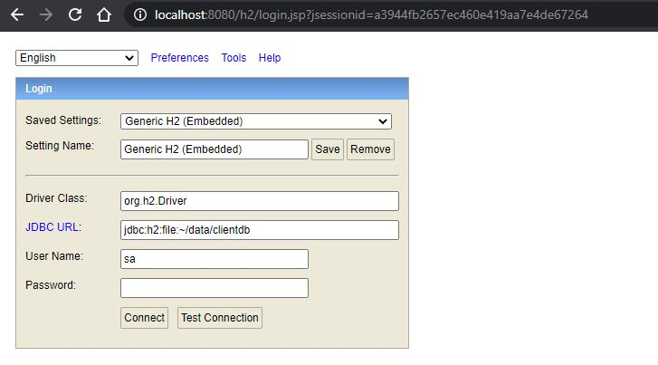
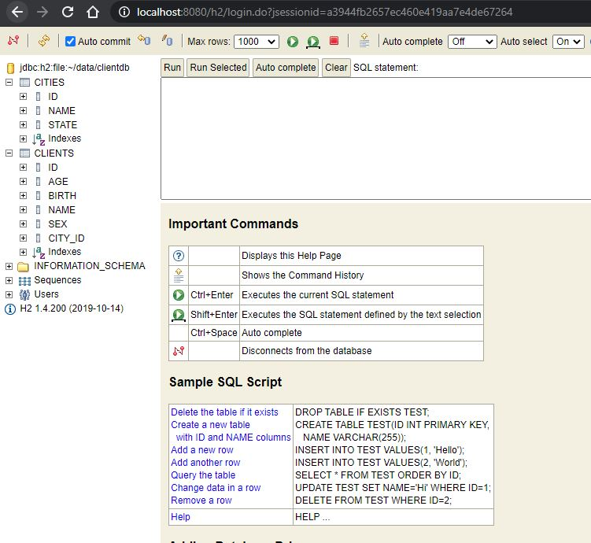
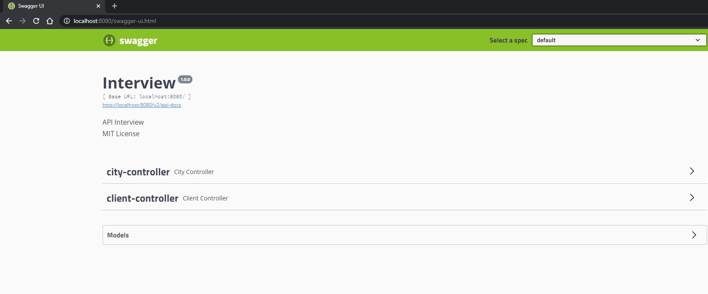
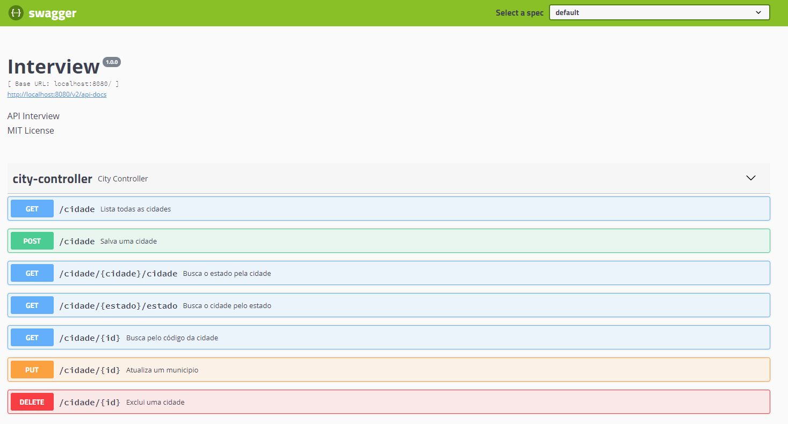
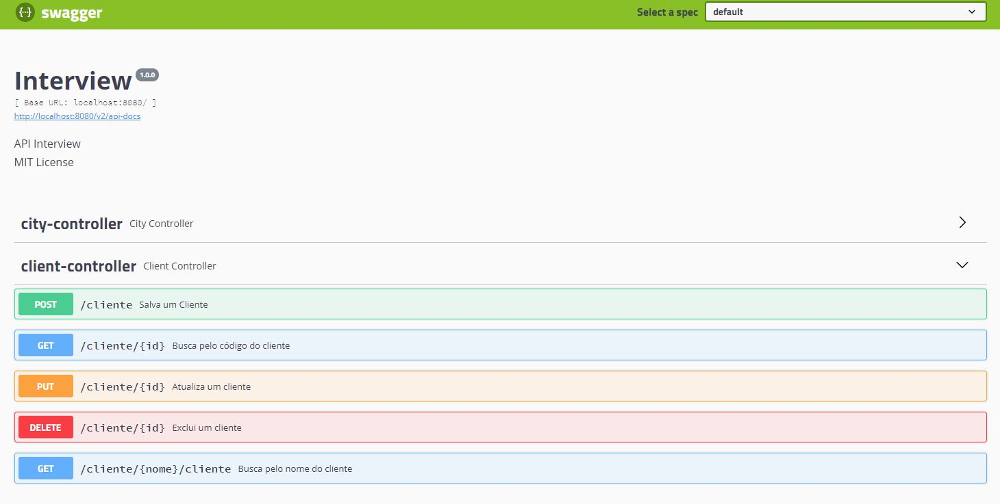
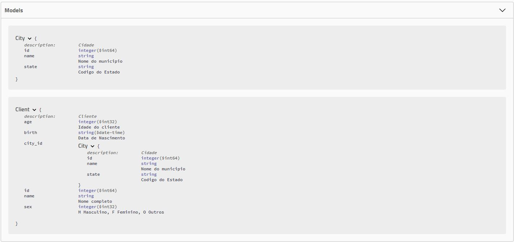

# spring-boot-interview

## :information_source: Informações do desafio

Construa o código que contemple as seguintes operações expostas como endpoints REST para:

* Cadastrar cidade
* Cadastrar cliente
* Consultar cidade pelo nome
* Consultar cidade pelo estado
* Consultar cliente pelo nome
* Consultar cliente pelo Id
* Remover cliente
* Alterar o nome do cliente

Considere o cadastro com dados básicos:

* Cidades: nome e estado
* Cliente: nome completo, sexo, data de nascimento, idade e cidade onde mora.


## :rocket: Tecnologias Utilizadas 

```
- Java 8
- Maven
- Spring Boot
- Hibernate
- Database H2
```

## :iphone: Telas

<p align="center">

</p>

<p align="center">

</p>
<p align="center">

</p>

<p align="center">

</p>
<p align="center">

</p>
<p align="center">

</p>
<p align="center">

</p>

